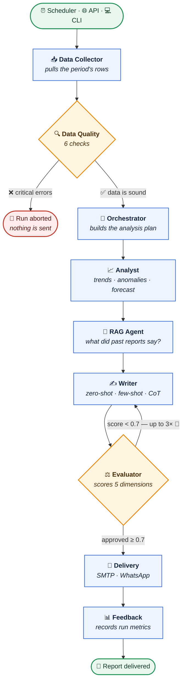
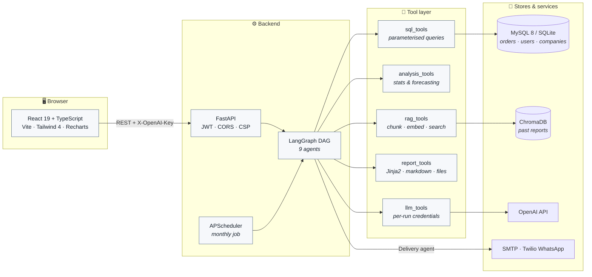
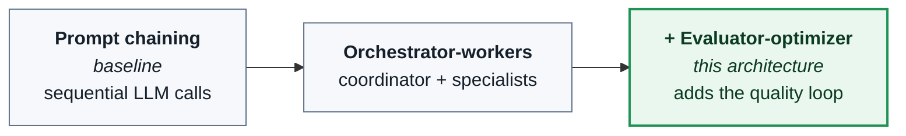

<div align="center">

# 📊 Proactive Reporting Agent

### Nine agents read your sales database, argue about the draft, and deliver the report before anyone asks for it.

[](https://github.com/Ediz-Ural/proactive-reporting-agent/actions/workflows/ci.yml)
[](#-testing)
[](LICENSE)
[](https://www.python.org/)
[](https://langchain-ai.github.io/langgraph/)
[](https://fastapi.tiangolo.com/)
[](https://react.dev/)
[](https://docs.docker.com/compose/)

**[Quick start](#-quick-start)** · **[How it works](#-how-it-works)** · **[The agents](#-the-nine-agents)** · **[Usage](#-usage)** · **[Configuration](#-configuration)** · **[Security](#-security)** · **[Experiments](#-experiment-design)**

</div>

---

## 🎯 The idea

Most reporting tools wait to be asked. **This one doesn't.**

On the first of the month, at 08:00, nobody asks for anything — and a pipeline wakes up anyway. It pulls the period's rows, **refuses to continue if the data isn't trustworthy**, runs real statistics over what it found, remembers what last month's report said, writes an executive summary with an LLM, then hands that summary to a second model that **scores it and sends it back for a rewrite when it falls short**. Only a draft that survives that loop gets emailed.

```
        no human in the loop
                 │
   08:00  ───────▼────────────────────────────────────────────────►  inbox
          collect → validate → analyse → recall → write ⇄ score → deliver
                       │                            └── up to 3 rewrites
                       └── bad data? the run stops here, nothing is sent
```

It is a working system rather than a sketch: a FastAPI backend, a React 19 dashboard, JWT auth with multi-tenant company isolation, a Docker Compose stack, **416 tests**, and the experiment scripts the project was originally built to run.

---

## ✨ Highlights

<table>
<tr>
<td width="50%" valign="top">

### 🤖 A pipeline that can say no
Nine LangGraph nodes with **two decision points**: a quality gate that aborts the run on untrustworthy data, and an evaluator loop that returns the draft to the writer until it scores ≥ 0.7.

</td>
<td width="50%" valign="top">

### 📐 Real statistics, not vibes
Mann-Kendall trend tests, Isolation Forest + z-score + IQR anomaly detection, Prophet forecasts, STL decomposition, RFM segmentation and anonymised sector benchmarking.

</td>
</tr>
<tr>
<td width="50%" valign="top">

### 🧠 RAG with a sense of time
ChromaDB retrieval over past reports, filtered on a numeric `period_end_ts` so **a report can never cite the future** — no leakage into a backfilled run.

</td>
<td width="50%" valign="top">

### 🔑 Bring your own API key
Each user enters their own OpenAI key and model. It lives in that tab's `sessionStorage`, travels as a request header, is bound to one run, and **never touches the database, the disk or the logs**.

</td>
</tr>
<tr>
<td width="50%" valign="top">

### 🏢 Multi-tenant by construction
JWT auth, every query parameterised and scoped by the `company_id` in the caller's token, and an admin surface for companies, users and CSV upload.

</td>
<td width="50%" valign="top">

### 🧪 Built to be measured
An A/B test across three prompting strategies and a prompt-chaining vs. multi-agent comparison — both scored by the Evaluator agent on quality, latency and token cost.

</td>
</tr>
</table>

Plus: SMTP + Twilio WhatsApp delivery, an APScheduler monthly job, a dashboard with live pipeline progress, KPI cards, charts and a sandboxed report viewer.

---

## 🔀 How it works

### The pipeline



> **The two diamonds are the whole point.** A linear chain of LLM calls always produces
> *something*. This graph has one node allowed to stop the run and another allowed to
> reject the writer's work — which is what separates the multi-agent pattern from prompt
> chaining, and what the [experiment scripts](#-experiment-design) actually measure.

### The system around it



---

## 🧑‍🚀 The nine agents

Every agent reads and writes one shared `AgentState` (`src/graph/state.py`) — a TypedDict
threaded through the graph, where `errors` is an `Annotated[list, operator.add]` so any
node can append without clobbering another's.

| # | Agent | Reads from state | Writes to state | What it actually does |
|:--:|---|---|---|---|
| 1 | 📥 **Data Collector** | `start_date`, `end_date`, `company_id` | `raw_data` | Parameterised SQL against MySQL/SQLite; packages the period, category breakdown, top products, customer metrics |
| 2 | 🔍 **Data Quality** | `raw_data` | `quality_report` | Six checks — nulls, negatives, date consistency, duplicates, numeric types, z-score outliers. **Holds the gate.** |
| 3 | 🧭 **Orchestrator** | `raw_data`, `quality_report` | `analysis_plan` | Decides which analyses this period deserves; optionally LLM-driven |
| 4 | 📈 **Analyst** | `analysis_plan`, `raw_data` | `analysis_results` | Trends, anomalies, period comparison, category performance, forecast, STL decomposition, RFM, sector comparison |
| 5 | 🧠 **RAG Agent** | `analysis_results`, dates | `historical_context` | Turns findings into queries, retrieves past-report chunks from ChromaDB with a **strict past-only filter** |
| 6 | ✍️ **Writer** | everything above + `evaluation` | `draft_report` | Builds a zero-shot / few-shot / CoT prompt and calls the LLM; falls back to a template report with no key |
| 7 | ⚖️ **Evaluator** | `draft_report`, `analysis_results`, `raw_data` | `evaluation` | Scores five dimensions and decides approve vs. revise |
| 8 | 📧 **Delivery** | `final_report`, `recipients` | `delivery_status` | Renders the Jinja2 HTML template, sends over SMTP and/or Twilio WhatsApp, archives the file |
| 9 | 📊 **Feedback** | the full final state | `feedback_metrics` | Appends the run to `data/metrics/pipeline_runs.jsonl` for later analysis |

### 🚦 Gate 1 — the Data Quality check

The run **stops entirely** if any check produces a critical error. A report that is never
sent beats a confident report built on broken rows.

| # | Check | ⚠️ Warning | ⛔ Error *(aborts the run)* |
|:--:|---|---|---|
| 1 | **Nulls** per column | ≥ 5% missing | ≥ 20% missing |
| 2 | **Negative values** in `sales`, `quantity` | — | any negative value |
| 3 | **Date consistency** | check could not run | any `ship_date` < `order_date` |
| 4 | **Duplicates** on `(order_id, product_id)` | any duplicate pair | — |
| 5 | **Numeric types** in the aggregate columns | — | any non-numeric value |
| 6 | **Statistical outliers** in `sales`, `profit` | `\|z\| > 3.0` | — |

### ⚖️ Gate 2 — the Evaluator rubric

A second LLM call scores the draft against the source data on five dimensions, each `0.0–1.0`:

| Dimension | The question it asks |
|---|---|
| `numerical_accuracy` | Do the figures in the prose match the analysis output? |
| `completeness` | Are trend, anomaly, forecast, category and action sections all present? |
| `readability` | Can a non-technical reader follow it? |
| `actionability` | Is every recommendation tied to a specific finding? |
| `hallucination_free` | Does anything appear that the source data never said? |

```
overall_score = mean(the five dimensions)
approved      = overall_score >= 0.7        ← APPROVAL_THRESHOLD

approved  ────────────────────────────────►  Delivery
rejected  ──► Writer, with written feedback ──► re-scored
              (at most MAX_EVALUATOR_ITERATIONS = 3, then shipped anyway)
```

The loop is bounded on purpose: a pipeline that can rewrite forever is a pipeline that can
burn a token budget forever.

---

## 📄 What comes out

Reports are generated in **Turkish** for the demo dataset. A real excerpt from
`data/sample_reports/`:

```markdown
## Aylık Satış Raporu — 2017-01-01 / 2017-01-31

### Özet Göstergeler
- Toplam gelir: 43,971.37 TL (önceki aya göre -%54.5)
- Sipariş sayısı: 155 (önceki aya göre -%55.8)
- Kâr marjı: %16.2

### Önemli Bulgular
- [TREND] Beklenen yılbaşı sonrası düşüş gerçekleşti. Gelir Aralık'taki
  96,712.68 TL'den 43,971.37 TL'ye geriledi (-%54.5).
- [ANOMALİ] Furniture kategorisi 5,964.04 TL satışla -39.45 TL zarar etti.
  Tables ve Chairs alt kategorileri negatif kârlılıkta.
- [TAHMİN] Şubat ayında toparlanma sınırlı kalabilir.
  Tahmini gelir: 18,000-25,000 TL aralığı.
```

Note what the `[ANOMALİ]` line is doing: the Analyst found a category that sold well and
still lost money, and the Writer surfaced it above the headline revenue drop. That is the
kind of finding a dashboard shows you only if you already knew to look.

---

## 🛠️ Tech stack

<div align="center">

| Layer | Technology |
|---|---|
| **Multi-agent** | LangGraph 0.2+ · LangChain 0.3+ |
| **LLM** | OpenAI GPT-4o, with a per-user key and model |
| **RAG** | ChromaDB + `text-embedding-3-small` |
| **Database** | SQLite (dev) · MySQL 8.0 (prod) · SQLAlchemy 2.0 |
| **Analysis** | pandas · numpy · scikit-learn · statsmodels · scipy · prophet · pymannkendall |
| **Reporting** | Jinja2 · python-docx · matplotlib · plotly |
| **API** | FastAPI · uvicorn · JWT (python-jose) · bcrypt |
| **Frontend** | React 19 · TypeScript · Vite · Tailwind CSS 4 · Recharts |
| **Scheduling** | APScheduler |
| **Delivery** | SMTP · Twilio WhatsApp |
| **Container** | Docker · Docker Compose · nginx |
| **Quality** | pytest (416 tests) · ruff · GitHub Actions |
| **Observability** | LangSmith *(optional)* |

</div>

---

## 🚀 Quick start

### Option A — SQLite, no Docker

```bash
git clone git@github.com:Ediz-Ural/proactive-reporting-agent.git
cd proactive-reporting-agent

python -m venv .venv
source .venv/bin/activate            # Windows: .venv\Scripts\activate
pip install -e ".[dev]"

cp .env.example .env                 # OPENAI_API_KEY is optional — see "API keys"

python data/seed_db.py --generate    # 5,000 synthetic rows + demo companies and users
python data/seed_reports.py          # optional: index the sample reports into ChromaDB

pytest -q                            # 416 tests
uvicorn src.api:app --reload         # API on http://localhost:8000
```

Frontend, in a second terminal:

```bash
cd frontend
npm install
npm run dev                          # http://localhost:5173
```

### Option B — Docker Compose (MySQL + API + frontend + Adminer)

```bash
cp .env.example .env                 # set DB_TYPE=mysql and a DB_PASSWORD
docker compose up -d
docker compose exec app python data/seed_db.py --generate
```

| Service | URL |
|---|---|
| 🖥️ Dashboard | <http://localhost:3000> |
| 📚 API docs | <http://localhost:8000/docs> |
| 🗄️ Adminer | <http://localhost:8080> |

### 🔐 Signing in

`seed_db.py` creates demo accounts for local exploration. **Change or remove them before
putting an instance anywhere real.**

| Role | Email | Password |
|---|---|---|
| Admin | `admin@superstore.com` | `admin123` |
| Company user | `user@<company-domain>` | `user123` |

### 🔑 API keys

Every user brings their own OpenAI credentials. Enter a key and pick a model under
**Ayarlar** (Settings) in the dashboard: the key is held in that tab's `sessionStorage`
and sent as an `X-OpenAI-Key` header on the requests that run the pipeline. The server
uses it for that run and never writes it to disk — so no key of yours ends up in the
database, the logs or a backup, and closing the tab clears it from the browser too. The
model preference is not a secret, so it is remembered across visits.

`OPENAI_API_KEY` in `.env` is an optional fallback for runs with no user behind them: the
scheduler, `scripts/`, and direct `run_pipeline` calls. With neither a header nor an env
key the pipeline still runs end to end — the LLM steps (writer, evaluator) fall back to a
template report instead of failing.

### 📦 Data

The seeder generates synthetic data by default. To use the Kaggle *Sample Superstore*
dataset instead, download it yourself and point the seeder at it — it is not redistributed
here:

```bash
python data/seed_db.py --csv data/raw/superstore.csv
```

---

## 📘 Usage

**Run the pipeline from Python**

```python
from src.graph.workflow import run_pipeline

state = run_pipeline(
    start_date="2017-06-01",
    end_date="2017-06-30",
    report_type="monthly",
    company_id=1,
    api_key="sk-...",      # optional; falls back to OPENAI_API_KEY
    model="gpt-4o-mini",   # optional; falls back to OPENAI_MODEL
)

print(state["final_report"])
print(state["evaluation"]["overall_score"])   # e.g. 0.86
print(state["evaluator_iteration"])           # how many rewrites it took
```

Need resilience against a flaky API? `run_pipeline_with_retry(...)` wraps the same call
with exponential backoff (1s → 2s → 4s).

**Run the experiments**

```bash
python scripts/batch_generate.py --start 2017-01     # reports for every company
python scripts/ab_test.py --runs 3 --company-id 1    # zero-shot vs few-shot vs CoT
python scripts/pattern_comparison.py --runs 5        # prompt chaining vs multi-agent
```

Each script sweeps three fixed periods (Mar / Jun / Sep 2017), repeats every configuration
`--runs` times, scores each output with the Evaluator, and writes raw plus aggregated
results — mean, std, min, max — to `data/ab_test/`, `data/pattern_comparison/` and
`data/metrics/`. All git-ignored.

<details>
<summary><b>🌐 API endpoints</b></summary>

<br>

| Method | Path | Description |
|---|---|---|
| `POST` | `/auth/login` | Obtain a JWT |
| `POST` | `/auth/register` | Create a user *(admin)* |
| `GET` | `/auth/me` | Current token's identity |
| `POST` | `/run` | Start a pipeline run in the background (accepts `X-OpenAI-Key`) |
| `POST` | `/run/monthly` | Run for the previous month |
| `POST` | `/run/sync` | Run and wait for the full result |
| `GET` | `/runs` · `/runs/latest` · `/runs/{id}` | Run history, live status, detail |
| `GET` | `/reports` · `/reports/{filename}` | List and fetch generated reports |
| `GET` | `/db/stats` · `/rag/stats` | Row counts and vector-store statistics |
| `GET` | `/health` | Liveness probe |
| `POST` | `/admin/upload-data` | Upload a CSV for a company *(admin)* |
| `GET`/`POST` | `/admin/companies` | Tenant administration *(admin)* |
| `GET` | `/admin/users` · `/admin/company-stats` | Tenant overview *(admin)* |
| `POST` | `/admin/send-report` · `/admin/send-existing-report` | Manual delivery *(admin)* |

Interactive documentation lives at `/docs`.

</details>

<details>
<summary><b>📁 Project layout</b></summary>

<br>

```
proactive-reporting-agent/
├── config/
│   ├── settings.py        # Pydantic settings + production guards
│   └── logging_config.py
├── data/
│   ├── seed_db.py         # synthetic generator / CSV importer
│   ├── seed_reports.py    # indexes sample reports into ChromaDB
│   └── sample_reports/    # three real generated reports
├── src/
│   ├── agents/            # one file per agent — nine of them
│   ├── tools/             # sql · analysis · rag · report · llm
│   ├── graph/
│   │   ├── state.py       # the shared AgentState TypedDict
│   │   └── workflow.py    # the LangGraph DAG + routing functions
│   ├── api.py             # FastAPI app
│   ├── auth.py            # JWT auth + bcrypt
│   └── scheduler.py       # APScheduler monthly job
├── frontend/              # React 19 + TypeScript dashboard
│   └── src/pages/         # Dashboard · Pipeline · Reports · Settings · admin/
├── scripts/               # batch generation and experiments
├── templates/             # Jinja2 HTML report template
├── tests/                 # 416 pytest tests
├── docker-compose.yml
└── pyproject.toml
```

</details>

---

## ⚙️ Configuration

Everything comes from environment variables or `.env` (see `.env.example`).

| Variable | Default | Description |
|---|---|---|
| `ENV` | `development` | Set to `production` to enable startup guards |
| `JWT_SECRET_KEY` | placeholder | **Required in production** — startup fails on the placeholder or anything under 32 characters |
| `DB_TYPE` | `sqlite` | `sqlite` or `mysql` |
| `SQLITE_PATH` | `data/reporting_agent.db` | SQLite file path |
| `DB_HOST` · `DB_PORT` · `DB_USER` · `DB_PASSWORD` · `DB_NAME` | — | MySQL connection |
| `OPENAI_API_KEY` | — | Optional fallback; users supply their own key in the UI |
| `OPENAI_MODEL` | `gpt-4o` | Default model when the user picks none |
| `EMBEDDING_MODEL` | `text-embedding-3-small` | Embedding model |
| `CHROMA_PERSIST_DIR` | `data/chroma` | Vector store location |
| `WRITER_STRATEGY` | `few_shot` | `zero_shot` · `few_shot` · `cot` |
| `MAX_EVALUATOR_ITERATIONS` | `3` | Writer→Evaluator revision limit |
| `SMTP_*` · `REPORT_RECIPIENTS` | — | Email delivery |
| `TWILIO_*` · `WHATSAPP_*` | — | Optional WhatsApp delivery |
| `SCHEDULER_ENABLED` | `false` | Enable the monthly job |
| `SCHEDULER_HOUR` · `SCHEDULER_MINUTE` | `8` · `0` | When the monthly job fires |
| `LANGCHAIN_*` | — | Optional LangSmith tracing |

Generate a real secret with:

```bash
python -c "import secrets; print(secrets.token_urlsafe(32))"
```

A real `.env` is git-ignored and should never be committed.

---

## 🧪 Testing

```bash
pytest -q                    # full suite — 416 tests
pytest --cov=src -q          # with coverage
ruff check .                 # lint
```

Coverage spans every agent, the routing functions, both gates, the auth and tenant-isolation
paths, the delivery adapters, the analysis tools and a full end-to-end pipeline run. CI runs
the backend lint and tests plus the frontend lint and build on every push and pull request.

---

## 🔒 Security

Report text is assembled from uploaded rows and LLM output, and users keep their own
OpenAI key in the browser — so the question that matters is what happens when markup
reaches a page.

- **🧊 Report HTML is inert.** Markup in the source is escaped before markdown conversion,
  the Jinja template renders with autoescape on, and the dashboard shows the result in a
  fully sandboxed `<iframe>`: no scripts, no same-origin access, no forms. A `<script>` in
  a product name stays text at every step.
- **🛡️ Content-Security-Policy.** The production bundle is served with `script-src 'self'`
  and contains no inline script. API responses carry `default-src 'none'; sandbox` plus
  `nosniff`, so an API URL opened directly cannot render as a document; `/docs` gets its
  own policy for Swagger's CDN.
- **🔑 Credentials.** The user's OpenAI key travels as a request header, is bound to a single
  run, and never reaches the database or the logs; in the browser it lives in
  `sessionStorage`, scoped to one tab. Passwords are bcrypt hashes and JWTs are signed
  with `JWT_SECRET_KEY`.
- **🚧 Production guards.** With `ENV=production`, the app refuses to start on the shipped
  placeholder `JWT_SECRET_KEY` or a secret under 32 characters — a misconfigured deployment
  fails loudly at boot instead of quietly accepting forged tokens.
- **🏢 Tenant isolation.** Every query is parameterised and scoped by the `company_id` in the
  caller's token; only admins can address another company.

The seeded demo accounts exist for local exploration — remove them before exposing an
instance to anyone.

---

## 🔬 Experiment design

The project exists to compare agentic design patterns on one dataset, under one evaluator.



Each pattern runs across the same three periods with several context strategies
(zero-shot, few-shot, chain-of-thought) and is scored on **report quality, latency and
token cost** by the Evaluator agent. Results land as JSON in `data/pattern_comparison/`
and `data/ab_test/`, with per-run raw records alongside aggregated statistics.

Run them yourself:

```bash
python scripts/ab_test.py --runs 3 --company-id 1
python scripts/pattern_comparison.py --runs 5
```

---

## 📄 License

MIT — see [LICENSE](LICENSE).

<div align="center">
<br>

**Built by [Ediz Ural](https://github.com/Ediz-Ural)** · If this was useful, a ⭐ is appreciated

</div>
