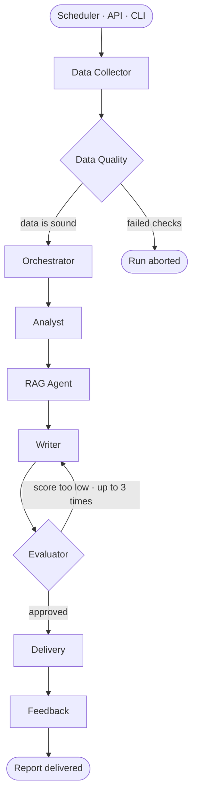

<div align="center">

# Proactive Reporting Agent

**Nine agents that read your sales database, argue about the draft, and deliver the report before anyone asks for it.**

[](https://github.com/Ediz-Ural/proactive-reporting-agent/actions/workflows/ci.yml)
[](LICENSE)
[](https://www.python.org/)
[](https://langchain-ai.github.io/langgraph/)
[](https://react.dev/)

[Quick start](#quick-start) · [How it works](#how-it-works) · [Usage](#usage) · [Configuration](#configuration) · [Security](#security)

</div>

---

Most reporting tools wait to be asked. This one runs on a schedule: it pulls the period's
rows, refuses to continue if the data is not trustworthy, analyses trends and anomalies,
retrieves what earlier reports said, writes an executive summary with an LLM, scores that
summary and sends it back for a rewrite when it falls short — and only then delivers it by
email or WhatsApp.

It is a working system rather than a sketch: FastAPI backend, React dashboard, JWT auth
with multi-tenant company isolation, a Docker Compose stack, 407 tests, and the scripts
behind the agent-pattern experiments the project was built to run.

## Features

| | |
|---|---|
| **9-agent pipeline** | A LangGraph DAG with a quality gate that can abort the run and an evaluator loop that can send the report back for a rewrite |
| **Real statistics** | Mann-Kendall trend tests, Isolation Forest and z-score anomalies, Prophet forecasts, category and sector comparison |
| **RAG with a sense of time** | ChromaDB retrieval over past reports, filtered so a report can never cite the future |
| **Bring your own API key** | Each user enters their own OpenAI key and model; the key stays in their tab and is never stored server-side |
| **Multi-tenant** | JWT auth, per-company data isolation, admin endpoints for companies, users and CSV upload |
| **Delivery** | SMTP email from an HTML template, optional WhatsApp through Twilio |
| **Dashboard** | Pipeline progress, KPI cards, charts, report viewer, admin panel |
| **Experiments** | An A/B test across prompting strategies and a prompt-chaining vs. multi-agent comparison, both scored by the evaluator |

---

## How it works



| Agent | Responsibility |
|---|---|
| **Data Collector** | Queries MySQL/SQLite and packages the period's raw data |
| **Data Quality** | Null checks, outliers, date consistency — holds the gate that stops a bad run |
| **Orchestrator** | Builds the analysis plan and routes the run |
| **Analyst** | Trends, anomalies, forecasts, category and sector performance |
| **RAG Agent** | Retrieves context from earlier reports |
| **Writer** | Generates the executive report via LLM (zero-shot / few-shot / CoT) |
| **Evaluator** | Scores the draft and returns it for revision until it passes |
| **Delivery** | Sends the report over SMTP and/or WhatsApp |
| **Feedback** | Records run metrics for later personalisation |

<details>
<summary><b>Tech stack</b></summary>

<br>

| Layer | Technology |
|---|---|
| Multi-agent | LangGraph 0.2+ / LangChain 0.3+ |
| LLM | OpenAI GPT-4o, with a per-user key and model |
| RAG | ChromaDB |
| Database | SQLite (dev) / MySQL 8.0 (prod), SQLAlchemy 2.0 |
| Analysis | pandas, numpy, scikit-learn, statsmodels, scipy, prophet, pymannkendall |
| Reporting | Jinja2, python-docx, matplotlib, plotly |
| API | FastAPI + uvicorn, JWT (python-jose), bcrypt |
| Frontend | React 19, TypeScript, Vite, Tailwind CSS 4, Recharts |
| Scheduler | APScheduler |
| Delivery | SMTP, Twilio WhatsApp |
| Container | Docker + Docker Compose |
| Observability | LangSmith (optional) |

</details>

---

## Quick start

### SQLite — no Docker

```bash
git clone git@github.com:Ediz-Ural/proactive-reporting-agent.git
cd proactive-reporting-agent

python -m venv .venv
source .venv/bin/activate            # Windows: .venv\Scripts\activate
pip install -e ".[dev]"

cp .env.example .env                 # OPENAI_API_KEY is optional — see "API keys"

python data/seed_db.py --generate    # 5,000 synthetic rows + demo companies and users
python data/seed_reports.py          # optional: index the sample reports into ChromaDB

pytest -q                            # 407 tests
uvicorn src.api:app --reload         # API on http://localhost:8000
```

Frontend, in a second terminal:

```bash
cd frontend
npm install
npm run dev                          # http://localhost:5173
```

### Docker Compose — MySQL, API, frontend, Adminer

```bash
cp .env.example .env                 # set DB_TYPE=mysql and a DB_PASSWORD
docker compose up -d
docker compose exec app python data/seed_db.py --generate
```

| Service | URL |
|---|---|
| Dashboard | http://localhost:3000 |
| API docs | http://localhost:8000/docs |
| Adminer | http://localhost:8080 |

### Signing in

`seed_db.py` creates demo accounts for local exploration. Change or remove them before
putting an instance anywhere real.

| Role | Email | Password |
|---|---|---|
| Admin | `admin@superstore.com` | `admin123` |
| Company user | `user@<company-domain>` | `user123` |

### API keys

Every user brings their own OpenAI credentials. Enter a key and pick a model under
**Ayarlar** (Settings) in the dashboard: the key is held in that tab's `sessionStorage`
and sent as an `X-OpenAI-Key` header on the requests that run the pipeline. The server
uses it for that run and never writes it to disk, so no key of yours ends up in the
database, the logs or a backup — and closing the tab clears it from the browser too. The
model preference is not a secret, so it is remembered across visits.

`OPENAI_API_KEY` in `.env` is an optional fallback for runs with no user behind them: the
scheduler, `scripts/`, and direct `run_pipeline` calls. With neither a header nor an env
key the pipeline still runs, but the LLM steps (writer, evaluator) are skipped.

### Data

The seeder generates synthetic data by default. To use the Kaggle *Sample Superstore*
dataset instead, download it yourself and point the seeder at it — it is not redistributed
here:

```bash
python data/seed_db.py --csv data/raw/superstore.csv
```

---

## Usage

**Run the pipeline from Python**

```python
from src.graph.workflow import run_pipeline

state = run_pipeline(
    start_date="2017-06-01",
    end_date="2017-06-30",
    report_type="monthly",
    company_id=1,
    api_key="sk-...",      # optional; falls back to OPENAI_API_KEY
    model="gpt-4o-mini",   # optional; falls back to OPENAI_MODEL
)
print(state["final_report"])
```

**Run the experiments**

```bash
python scripts/batch_generate.py --start 2017-01     # reports for every company
python scripts/ab_test.py --runs 3 --company-id 1    # compare prompting strategies
python scripts/pattern_comparison.py --runs 5        # prompt chaining vs. multi-agent
```

Output lands in `data/ab_test/`, `data/pattern_comparison/` and `data/metrics/`, all
git-ignored.

<details>
<summary><b>API endpoints</b></summary>

<br>

| Method | Path | Description |
|---|---|---|
| `POST` | `/auth/login` | Obtain a JWT |
| `POST` | `/run` | Start a pipeline run in the background (accepts `X-OpenAI-Key`) |
| `POST` | `/run/monthly` | Run for the previous month |
| `POST` | `/run/sync` | Run and wait for the full result |
| `GET` | `/runs`, `/runs/{id}` | Run history and status |
| `GET` | `/reports`, `/reports/{filename}` | List and fetch generated reports |
| `GET` | `/db/stats`, `/rag/stats` | Data and vector-store statistics |
| `POST` | `/admin/upload-data` | Upload a CSV for a company (admin) |
| `POST` | `/admin/companies` | Tenant administration (admin) |
| `POST` | `/admin/send-report` | Deliver a report manually (admin) |

Interactive documentation lives at `/docs`.

</details>

<details>
<summary><b>Project layout</b></summary>

<br>

```
proactive-reporting-agent/
├── config/            # Pydantic settings + logging config
├── data/              # seeders, sample reports, generated artefacts
├── src/
│   ├── agents/        # one file per agent
│   ├── tools/         # sql, analysis, rag, report, llm tools
│   ├── graph/         # LangGraph state + workflow DAG
│   ├── models/        # Pydantic schemas
│   ├── api.py         # FastAPI app
│   ├── auth.py        # JWT auth
│   └── scheduler.py   # APScheduler job
├── frontend/          # React + TypeScript dashboard
├── scripts/           # batch generation and experiments
├── templates/         # Jinja2 HTML report template
├── tests/             # pytest suite
├── docker-compose.yml
└── pyproject.toml
```

</details>

---

## Configuration

Everything comes from environment variables or `.env` (see `.env.example`).

| Variable | Default | Description |
|---|---|---|
| `DB_TYPE` | `sqlite` | `sqlite` or `mysql` |
| `SQLITE_PATH` | `data/reporting_agent.db` | SQLite file path |
| `DB_HOST` / `DB_PORT` / `DB_USER` / `DB_PASSWORD` / `DB_NAME` | — | MySQL connection |
| `OPENAI_API_KEY` | — | Optional fallback; users supply their own key in the UI |
| `OPENAI_MODEL` | `gpt-4o` | Default model when the user picks none |
| `EMBEDDING_MODEL` | `text-embedding-3-small` | Embedding model |
| `CHROMA_PERSIST_DIR` | `data/chroma` | Vector store location |
| `WRITER_STRATEGY` | `few_shot` | `zero_shot` / `few_shot` / `cot` |
| `MAX_EVALUATOR_ITERATIONS` | `3` | Writer→Evaluator revision limit |
| `JWT_SECRET_KEY` | placeholder | **Change this before any real deployment** |
| `SMTP_*`, `REPORT_RECIPIENTS` | — | Email delivery |
| `TWILIO_*`, `WHATSAPP_*` | — | Optional WhatsApp delivery |
| `SCHEDULER_ENABLED` | `false` | Enable the monthly job |
| `LANGCHAIN_*` | — | Optional LangSmith tracing |

A real `.env` is git-ignored and should never be committed.

---

## Testing

```bash
pytest -q                    # full suite
pytest --cov=src -q          # with coverage
ruff check .                 # lint
```

CI runs the backend lint and tests plus the frontend lint and build on every push and
pull request.

---

## Security

Report text is assembled from uploaded rows and LLM output, and users keep their own
OpenAI key in the browser — so the question that matters is what happens when markup
reaches a page.

- **Report HTML is inert.** Markup in the source is escaped before markdown conversion,
  the Jinja template renders with autoescape on, and the dashboard shows the result in a
  fully sandboxed `<iframe>`: no scripts, no same-origin access, no forms. A `<script>` in
  a product name stays text at every step.
- **Content-Security-Policy.** The production bundle is served with `script-src 'self'`
  and contains no inline script. API responses carry `default-src 'none'; sandbox` plus
  `nosniff`, so an API URL opened directly cannot render as a document; `/docs` gets its
  own policy for Swagger's CDN.
- **Credentials.** The user's OpenAI key travels as a request header, is bound to a single
  run, and never reaches the database or the logs; in the browser it lives in
  `sessionStorage`, scoped to one tab. Passwords are bcrypt hashes and JWTs are signed
  with `JWT_SECRET_KEY`.
- **Tenant isolation.** Every query is parameterised and scoped by the `company_id` in the
  caller's token; only admins can address another company.

The seeded demo accounts exist for local exploration — remove them before exposing an
instance to anyone.

---

## Experiment design

The project compares agentic design patterns on one dataset:

| Pattern | Description |
|---|---|
| Prompt chaining | Baseline — sequential LLM calls |
| Orchestrator-workers | Central coordinator with specialised workers |
| + Evaluator-optimizer | Adds the quality feedback loop (this architecture) |

Each pattern runs with several context strategies (zero-shot, few-shot, chain-of-thought)
and is scored on report quality, latency and token cost by the Evaluator agent.

---

## License

MIT — see [LICENSE](LICENSE).
